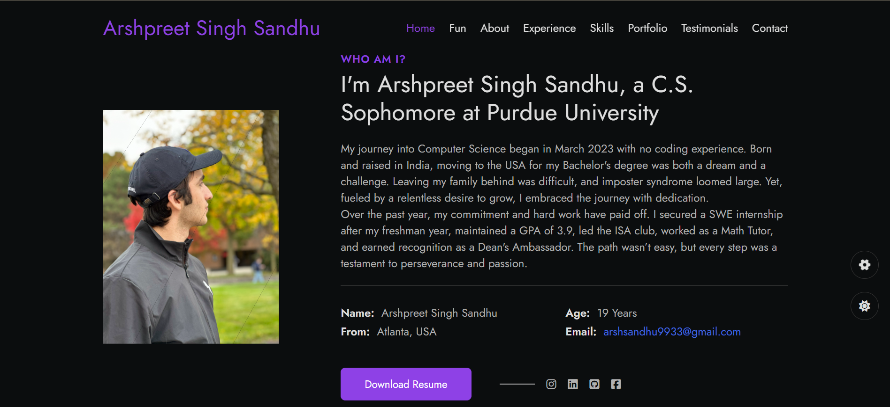
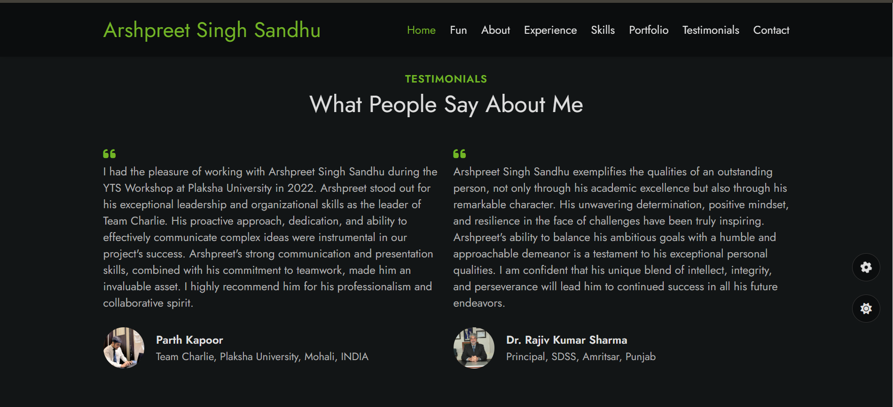

# My Portfolio Website
Welcome to the future of personal portfolios! This isn’t just another portfolio—it's a dynamic, interactive experience that showcases not just my skills, but my creativity and passion for pushing boundaries in web design. Explore a site that’s as fluid and responsive as my approach to problem-solving, where every click unveils a new layer of innovation.

## Try Here
[Portfolio Website- Arshpreet S. Sandhu](https://arshssandhu.github.io/#fun)

## Features
- **Interactive**
- **Unique Design**
- **Dark/Night Mode**
- **Color Changer Plugin**

## Technologies Used

## Take a Peek
**Interactive Sections**

**Try Dark/Night Mode**

**Set your Favourite theme Color**

